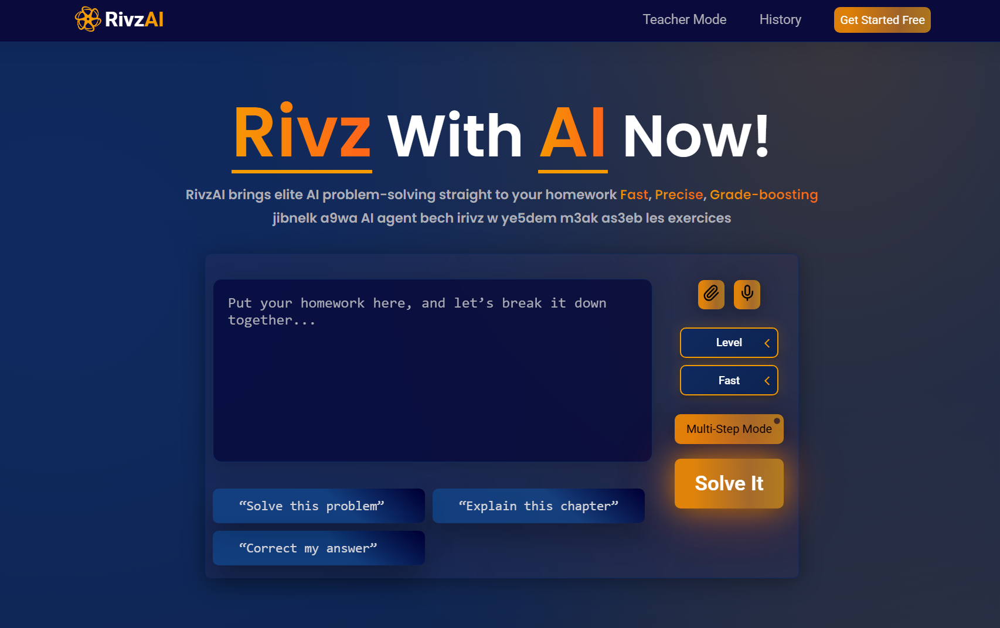
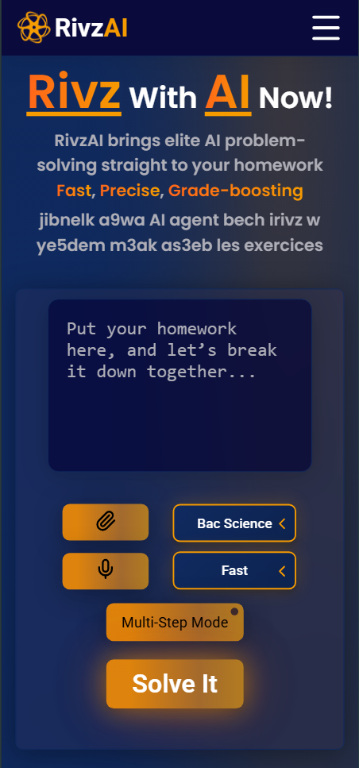

# RivzAI

RivzAI is an AI-powered educational platform designed to help students solve and understand homework problems according to the Tunisian school curriculum. It includes both **student and teacher modes**, as well as a **homework history** feature.

## Live Demo

🔗 **Demo:** https://rivzai.netlify.app/

> ⚠️ This is a demo version. AI responses are currently limited while the full backend and AI logic are under development.


### Desktop View


### Mobile View


## Features

- **Student Mode:** Ask questions and receive guided solutions to homework problems.  
- **Teacher Mode:** Review student interactions and generate exercises.  
- **Homework History:** Easily revisit previous questions and answers.  
- **Responsive Interface:** Optimized for both desktop and mobile.  
- **Demo Mode:** AI responses are currently in demo mode; full functionality coming soon.

## Tech Stack

- **HTML** for markup  
- **CSS** for styling and responsive layouts  
- **React** for interactive UI  
- **TypeScript** for type-safe development  

## Getting Started

Clone the repository and install dependencies:

```bash
git clone https://github.com/alimabrouki/RivzAI.git
cd RivzAI
npm install
npm run dev
