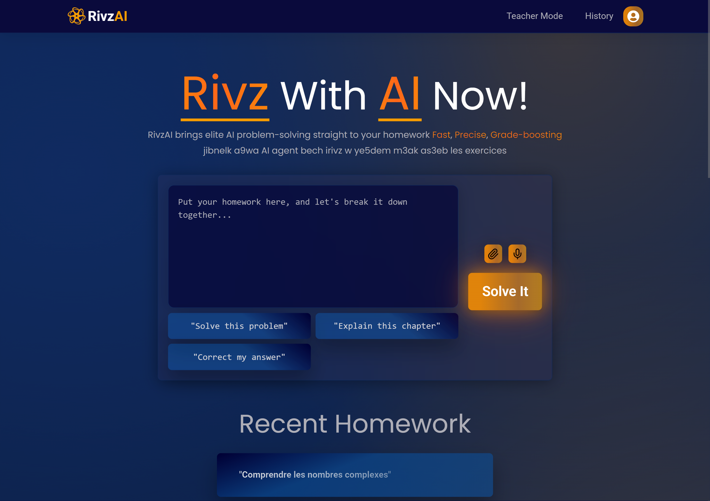
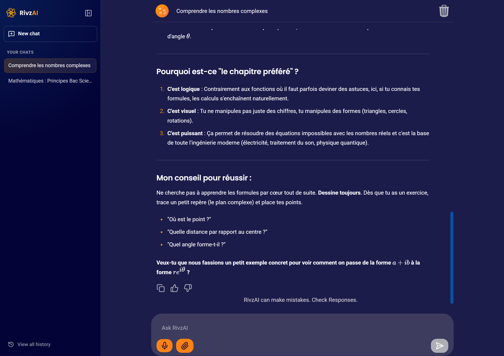
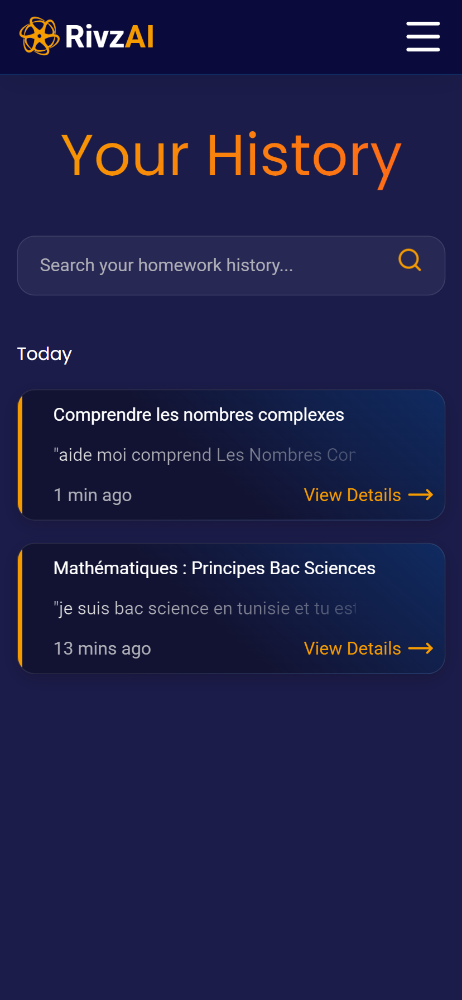
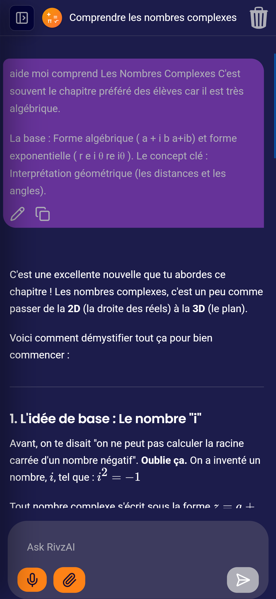
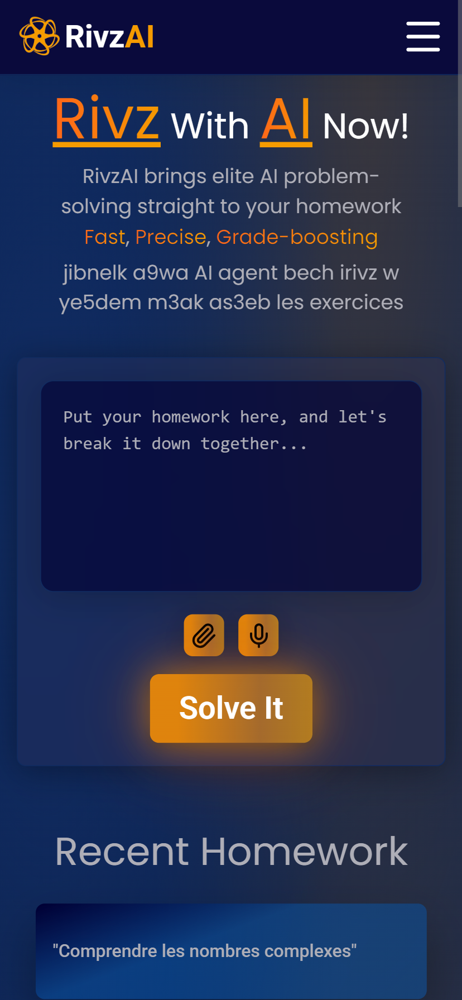

# RivzAI

RivzAI is an AI-powered educational platform designed to help students solve and understand homework problems according to the Tunisian school curriculum. It includes both **student and teacher modes**, as well as a **homework history** feature.

## Live Demo

🔗 **Demo:** [https://rivzai.netlify.app/](https://rivzai.netlify.app/)

### Desktop View





### Mobile View








## Features

- **Tunisian Curriculum:** AI assistance designed around the Tunisian Bac curriculum.

- **Student Mode:** Ask questions about lessons, exercises, and homework and receive step-by-step explanations adapted to the Tunisian curriculum.

- **Teacher Mode:** Generate exercises and educational content based on Tunisian secondary-school subjects and programs.

- **Subject-Based Learning:** Get help across major high-school subjects such as **Mathematics, Physics, Computer Science, French, English, Arabic, and Natural Sciences**.

- **Baccalaureate Preparation:** Practice and review concepts relevant to the Tunisian Baccalaureate program.

- **Homework History:** Easily revisit previous questions, exercises, and AI-generated explanations.

- **Responsive Interface:** Optimized for both desktop and mobile.

## Tech Stack

- **HTML** for markup

- **CSS** for styling and responsive layouts

- **React** for interactive UI

- **TypeScript** for type-safe development

- **Express** for building the backend API

- **Prisma** for database access and ORM

- **PostgreSQL** for data storage

- **Netlify** for deployment

## Getting Started

Clone the repository and install dependencies:

```bash
git clone https://github.com/alimabrouki/RivzAI.git

cd RivzAI

npm install

npm run dev
```
